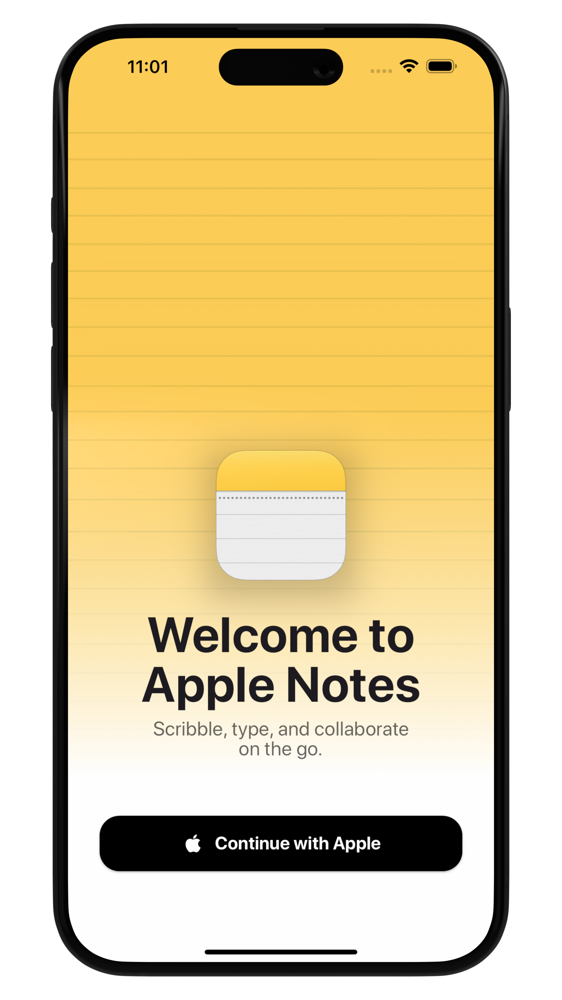

# Apple Notes Welcome Screen

This is a fun project created in just 1 hour, inspired by a beautiful design by [Kumail Nanji](https://x.com/KumailNanji). You can find the original design tweet [here](https://x.com/KumailNanji/status/1816452339068510275).

## Screenshots



## Features

- Custom font integration
- Gradient overlay on background image
- Responsive and clean UI design
- Elevated button with custom styles

## Installation

1. **Clone the repository:**
   ```sh
   git clone https://github.com/yourusername/apple-notes-welcome-screen.git
   cd apple-notes-welcome-screen

2. **Install dependencies:**
    flutter pub get

3. **Run the app:**
    flutter run

# How It Works
This project demonstrates how to create a visually appealing welcome screen using Flutter. It includes:

- Background Image: A full-screen background image with a gradient overlay.
- Custom Font: Integration of a custom font (SFProDisplay).
- Styled Text and Button: Clean and modern text styling along with a custom-styled button.

# Credits
Design by: Kumail Nanji
Developed by: cocolocow

# Contribution
Feel free to contribute to this project by submitting a pull request or opening an issue.
